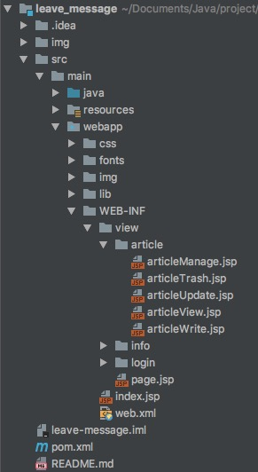
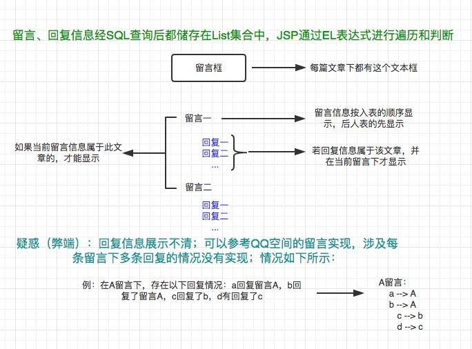
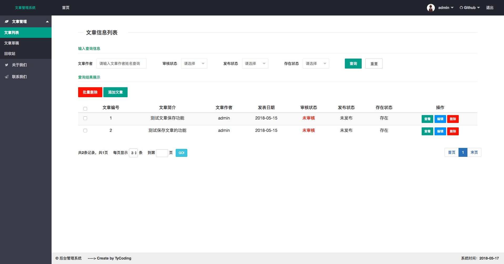
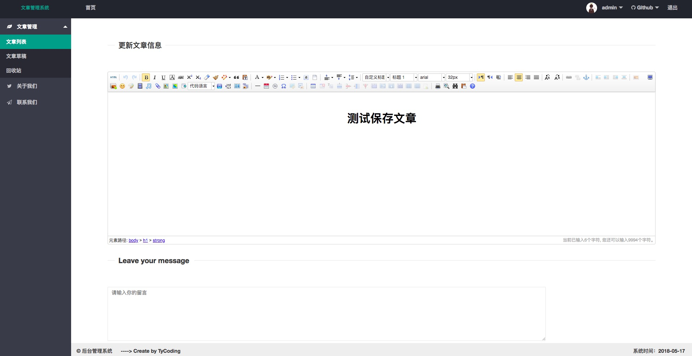
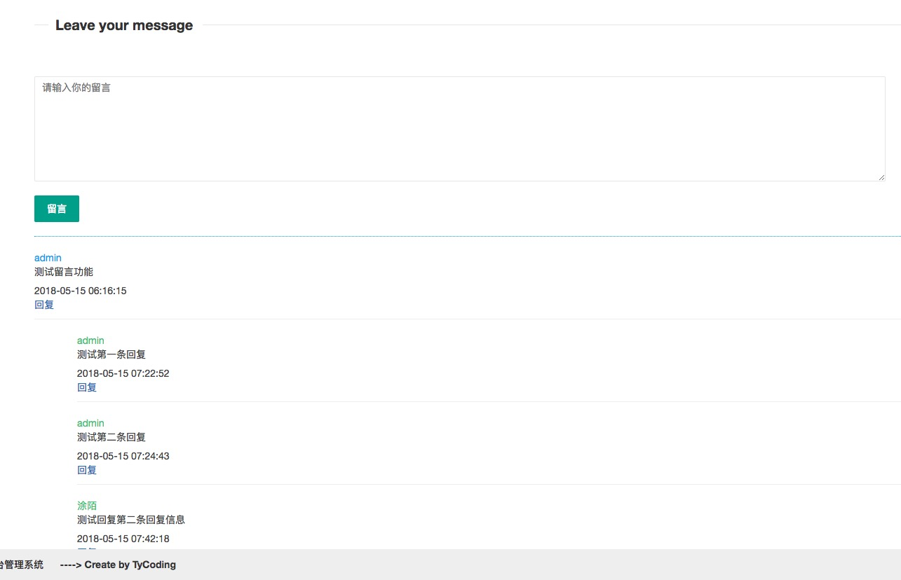

**一个简单的文章管理系统（增加留言回复功能）**

简单使用百度富文本实现了文章管理的功能，增加了留言回复功能，其实这个小项目只是为了测试怎样实现留言回复功能而提取出来的，并不是很完善，
主要实现了对文章的增删改查功能，项目后台页面使用了layui官网提供的后台模板。
留言回复功能详情请参看我这篇博文：[留言回复功能](http://tycoding.cn/2018/05/17/留言回复功能/)

**注**：本项目没有实现百度富文本的图片上传等一系列上传下载功能；采用MySQL建表来实现留言回复功能，这并不是一种合适的方式，如果有兴趣，
请移步去了解一下`RabbitMQ消息组件`，本人如果是个人练习的小项目，本篇博文应该对你有所帮助。

<!-- more -->

**关于项目：**
```
环境：jdk1.8 + mysql5.7 + maven + tomcat8 + IDEA
后端：spring + springmvc + mybatis
前端：layui + bootstrap + Ueditor(百度富文本编辑器)
数据库名称：leave_message
```
本项目GitHub地址：[GitHub](https://github.com/TyCoding/leave_message)

---

**注：**
本项目基于SSM框架，所以对SSM框架不是很了解的请参看我这篇博文:
[SSM框架整合](http://tycoding.cn/2018/04/24/SSM-Paging/)

## 开始正题
**项目目录结构**



### 1. 创建表结构
```
create database leave_message character set utf8;
```

1. admin表
```
create table admin(
    a_id int primary key auto_increment,
    a_name varchar(100),
    a_password varchar(100)
)default charset = utf8;
```

2. article表
```
create table article(
    r_id int primary key auto_increment,
    r_author varchar(100),
    r_summary varchar(100),
    r_content text,
)default charset = utf8;
```

3. 留言表
```
create table words(
  lw_id int primary key auto_increment,
  lw_name varchar(100),
  lw_date varchar(100),
  lw_content varchar(100),
  lw_for_name varchar(100),
  lw_for_article_id varchar(100)
)default charset = utf8;
```

4. 回复表
```
create table reply(
  lr_id int primary key auto_increment,
  lr_name varchar(100),
  lr_date varchar(100),
  lr_content varchar(100),
  lr_for_name varchar(100),
  lr_for_words varchar(100),
  lr_for_article_id varchar(100)
)default charset = utf8;
```

### 留言回复功能
这里不在解释，请参看我这篇博文[留言回复功能](http://tycoding.cn/2018/05/17/留言回复功能/)
上文已经说了，对于留言回复功能存在缺陷，详情请看：



### 文章管理功能
仅仅实现了文章信息的增删改查，没有啥复杂的功能，也没啥可解释了啦（逃

* 使用百度富文本添加文章
*

## 项目效果截图
**登录页(自己写的，感觉灰常好看了)**





## 交流

如果大家有兴趣，欢迎大家加入我的Java交流群：671017003 ，一起交流学习Java技术。博主目前一直在自学JAVA中，技术有限，如果可以，会尽力给大家提供一些帮助，或是一些学习方法，当然群里的大佬都会积极给新手答疑的。所以，别犹豫，快来加入我们吧！

<br/>

## 联系

If you have some questions after you see this article, you can contact me or you can find some info by clicking these links.

- [Blog@TyCoding's blog](http://www.tycoding.cn)
- [GitHub@TyCoding](https://github.com/TyCoding)
- [ZhiHu@TyCoding](https://www.zhihu.com/people/tomo-83-82/activities)